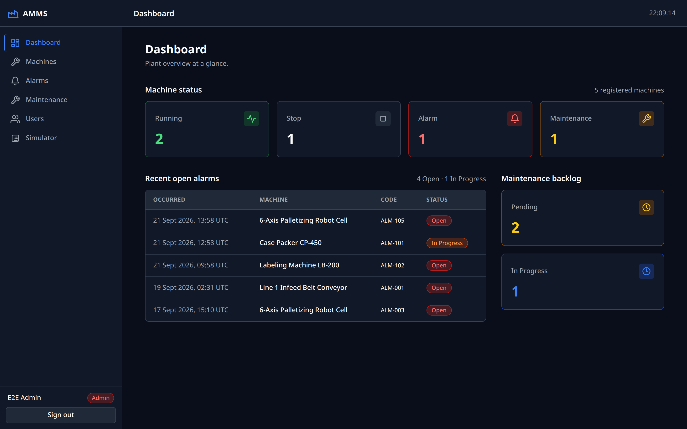
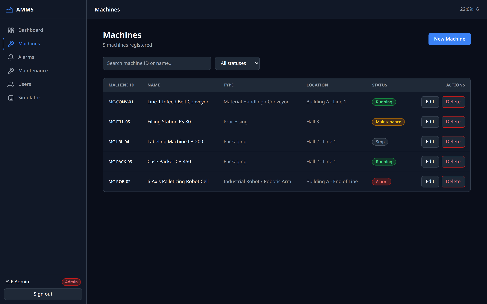
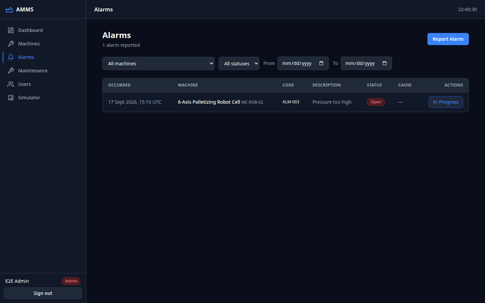
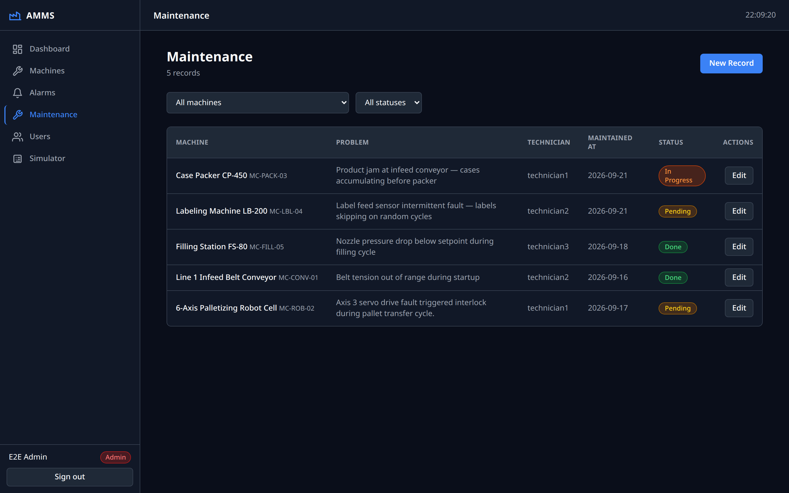
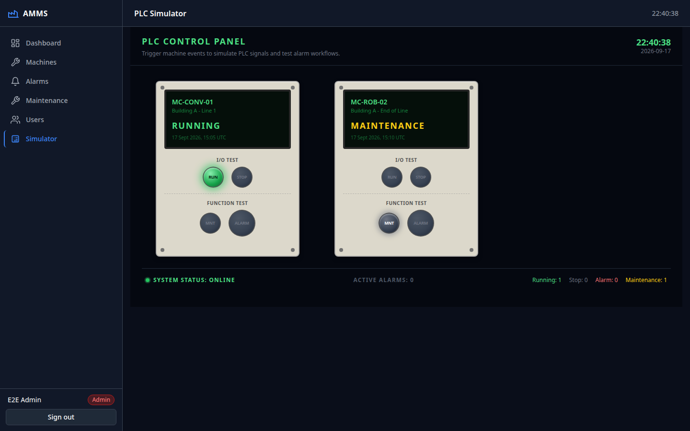

# Alarm & Maintenance Management System (AMMS)

## 1. ภาพรวมโครงการ

**Alarm & Maintenance Management System (AMMS)** คือระบบเว็บแอปพลิเคชันสำหรับจัดการข้อมูล **Machine**, **Alarm** และ **Maintenance** ของเครื่องจักรในโรงงาน ครอบคลุมวงจรการทำงานตั้งแต่การบันทึกสถานะเครื่องจักร การรับ-ปิด alarm การสั่งงานซ่อมบำรุง ไปจนถึงการติดตามภาพรวมผ่าน dashboard โดยรองรับผู้ใช้หลายบทบาท (Superadmin / Admin / Technician / Viewer) ผ่านระบบสิทธิ์แบบ role-based

## 2. ฟีเจอร์หลัก

- **Machine Master (CRUD)** — จัดการข้อมูลเครื่องจักร เพิ่ม/แก้ไข/ลบ (soft delete) พร้อมสถานะ Running, Stop, Maintenance, Alarm
- **Alarm Record (CRU + Status Transition)** — บันทึก alarm ของเครื่องจักร เปลี่ยนสถานะ Open → In Progress → Closed พร้อมบันทึกสาเหตุและผู้ใช้ที่ปิด
- **Maintenance Record (CRU)** — บันทึกงานซ่อมบำรุง เชื่อมโยงกับ machine และ alarm ได้ เปลี่ยนสถานะ Pending → In Progress → Done พร้อม action taken
- **Dashboard ภาพรวม** — สรุปสถานะเครื่องจักรทั้งหมด, alarm ล่าสุด และ backlog งานซ่อมบำรุง
- **Search & Filter** — ค้นหาและกรองข้อมูลในหน้า machines / alarms / maintenance
- **Role-based Access (Admin / Technician)** — ควบคุมสิทธิ์ตามบทบาทด้วย Middleware + Server Action + RLS
- **PLC Mock Simulator** — จำลองการเปลี่ยนสถานะเครื่องจักรจากฝั่ง OT (ดูหัวข้อที่ 8)

## 3. เทคโนโลยีที่ใช้

| หมวด | เทคโนโลยี |
| --- | --- |
| Frontend / Backend | Next.js 14 (App Router), TypeScript, Tailwind CSS |
| Database & Auth | Supabase (PostgreSQL + Auth + Row Level Security) |
| CI/CD | GitHub Actions (build → lint → test) |
| Deployment | Vercel |
| Package Manager | bun |

## 4. โครงสร้างฐานข้อมูล

### profiles
| คอลัมน์ | ประเภท | หมายเหตุ |
| --- | --- | --- |
| id | uuid (PK) | อ้างอิง `auth.users.id` |
| full_name | text | — |
| role | enum | `admin` \| `technician` \| `viewer` \| `superadmin` |
| created_at | timestamptz | — |

### machines
| คอลัมน์ | ประเภท | หมายเหตุ |
| --- | --- | --- |
| id | uuid (PK) | — |
| machine_id | text | รหัสเครื่องจักร |
| machine_name | text | — |
| machine_type | text | — |
| location | text | — |
| status | enum | `Running` \| `Stop` \| `Maintenance` \| `Alarm` |
| deleted_at | timestamptz (null) | soft delete |
| last_updated_at / created_at | timestamptz | — |

### alarms
| คอลัมน์ | ประเภท | หมายเหตุ |
| --- | --- | --- |
| id | uuid (PK) | — |
| machine_id | uuid (FK → machines.id) | เครื่องจักรที่เกิด alarm |
| alarm_code | text | รหัส alarm |
| description | text | รายละเอียด |
| cause | text (null) | สาเหตุ (กรอกตอนปิด) |
| occurred_at | timestamptz | เวลาเกิดเหตุการณ์ |
| status | enum | `Open` \| `In Progress` \| `Closed` |
| created_by / closed_by | uuid (FK → profiles.id, null) | ระบบกำหนดฝั่ง server เท่านั้น |
| closed_at | timestamptz (null) | ระบบกำหนดฝั่ง server เท่านั้น |

### maintenance_records
| คอลัมน์ | ประเภท | หมายเหตุ |
| --- | --- | --- |
| id | uuid (PK) | — |
| machine_id | uuid (FK → machines.id) | เครื่องจักรที่เข้าซ่อม |
| alarm_id | uuid (FK → alarms.id, null) | เชื่อมกับ alarm ที่เกี่ยวข้อง |
| technician_id | uuid (FK → profiles.id, null) | ช่างผู้รับผิดชอบ |
| problem | text | ปัญหาที่พบ |
| action_taken | text (null) | การแก้ไข (กรอกตอน Done) |
| maintained_at | timestamptz | เวลาเข้าซ่อม |
| status | enum | `Pending` \| `In Progress` \| `Done` |
| created_at | timestamptz | — |

### ความสัมพันธ์ระหว่างตาราง

```
profiles 1 ──── N alarms (created_by / closed_by)
profiles 1 ──── N maintenance_records (technician_id)
machines 1 ──── N alarms
machines 1 ──── N maintenance_records
alarms   1 ──── 0..1 maintenance_records (alarm_id)
```

สิทธิ์เข้าถึงข้อมูลควบคุมด้วย **Row Level Security (RLS)** ทุกตาราง พร้อมฟังก์ชัน `current_role_name()` สำหรับตรวจ role ใน policy

### บทบาทและสิทธิ์ (Role Permissions)

| สิทธิ์ | superadmin | admin | technician | viewer |
| --- | --- | --- | --- | --- |
| ดู dashboard | ✓ | ✓ | ✓ | ✓ |
| จัดการ machines / simulator | ✓ | ✓ | — | — |
| รับ-ปิด alarm, สั่งซ่อมบำรุง | ✓ | ✓ | ✓ | — |
| เปลี่ยน role ของผู้ใช้คนอื่น | ✓ (ทุกคน) | เฉพาะ technician/viewer | — | — |

กฎเพิ่มเติม:
- ไม่มีใครเปลี่ยน role ของตัวเองได้ (รวมถึง superadmin)
- admin ไม่สามารถจัดการบัญชี admin / superadmin และไม่สามารถตั้งบทบาท superadmin ได้
- superadmin เป็นบทบาทเดียวที่จัดการบัญชี admin / superadmin ได้

SQL schema ฉบับเต็ม (enum, table, index, RLS policy) อยู่ที่ [`supabase/schema.sql`](./supabase/schema.sql) — รันใน Supabase SQL Editor เพื่อสร้างฐานข้อมูลใหม่ทั้งหมด

## 5. วิธีรันโปรเจกต์

```bash
git clone https://github.com/Takashi468/alarm-maintenance-management-system.git
cd alarm-maintenance-management-system
bun install
cp .env.local.example .env.local
# แก้ไขค่าใน .env.local:
#   NEXT_PUBLIC_SUPABASE_URL
#   NEXT_PUBLIC_SUPABASE_ANON_KEY
#   SUPABASE_SERVICE_ROLE_KEY  (ใช้ฝั่ง server เท่านั้น)
bun run dev
```

เปิดใช้งานได้ที่ http://localhost:3000

## 6. Vercel URL

[https://amms-red.vercel.app](https://amms-red.vercel.app/)

## 6.1 Screenshot

| Dashboard | Machines |
| --- | --- |
|  |  |

| Alarms | Maintenance |
| --- | --- |
|  |  |



## 7. การนำ AI มาช่วยพัฒนา

- ใช้ AI ช่วยวิเคราะห์ Requirement ออกแบบ Database สร้าง Server Actions เขียน UI Components และ Debug ปัญหาตลอดการพัฒนา
- **คน** เป็นผู้ออกแบบ Security Boundary (Middleware → Server Action → RLS) และกำหนด Business Rule ของระบบ เช่น สถานะ alarm ที่เปลี่ยนได้, `closed_by`/`closed_at` ต้องมาจาก server เท่านั้น
- **AI** ทำหน้าที่ implement ตามกฎที่กำหนด และตรวจสอบความถูกต้องด้วย lint / typecheck / E2E test

## 8. PLC Mock Simulator

หน้า `/simulator` ทำหน้าที่เป็น **Integration Layer ระหว่างระบบ OT กับ IT** — ในสภาพแวดล้อมจริง สถานะเครื่องจักรและ alarm จะมาจาก PLC ผ่านระบบ fieldbus แต่ในเวอร์ชันนี้ใช้ mock แทน โดย Admin สามารถกดเปลี่ยนสถานะเครื่องจักร (Running / Stop / Maintenance / Alarm) ได้โดยตรง ซึ่งเทียบเท่ากับการที่ PLC รายงานสถานะเข้ามา และเมื่อตั้งเป็น `Alarm` ระบบจะสร้างบันทึก alarm ให้โดยอัตโนมัติ

**แผน V2:** เปลี่ยนจาก mock เป็น **API Gateway + MQTT/OPC UA** เพื่อเชื่อมต่อ PLC จริง โดยโครงสร้างฝั่ง application (Server Actions, RLS, UI) จะยังคงเดิม เพียงเปลี่ยนแหล่งที่มาของข้อมูลสถานะเครื่องจักรเท่านั้น
